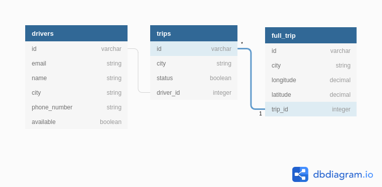

# Trips Task

[](https://www.codacy.com/manual/abdelrahmanhsn1/trips?utm_source=github.com&amp;utm_medium=referral&amp;utm_content=Abd-El-Rahman-HSN/trips&amp;utm_campaign=Badge_Grade)

#### Description Task
> track ongoing bus trips and save full trip location history

##### Things you may want to cover:
- Ruby version: 2.6.5
- Rails Versiom: 6.0.2
- Redis Version: 4.0.9
- Database: Postgresql
- Workers: Sidekiq
### How To Run Project
```sh
$ git clone git@github.com:Abd-El-Rahman-HSN/trips.git
$ cd trips
$ bundle install
```
#### Create Data Base
```sh
$ rails db:create
$ rails db:migrate
```
#### Run Project
```sh
$ rails s
$ bundle exec sidekiq
```

### I Have finished
- [x] CRUD for the trip
- [x] Update trip status: the status can be only changed in one direction. For example, the trip cannot be changed from completed to ongoing.
- [x] API full trip history
- [x] Write Unite Test whith Rspec
- [x] Serializing API
- [x] Optimization API Full Trip History Using sidekiq and Redis

### Tabels



### Logic Task

- Trip model for save trip bus that contain city, Enum of status (ongoing, completed) and driver_id and full_trip model for save full trip location history.
- Default Status trip is ongoing and you can change status to completed but  can't change completed status to ongoing.
- I use Database Postgresql and use Redis in caching API full trip location history because if we used record in Postgresql only in this case we will have a big performance issue in reading 
- And Use Background jobs (Sidekiq) Because it's expected to be a large number of recordings.